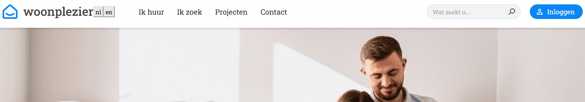

# Getting Started with Create React App

This project was bootstrapped with [Create React App](https://github.com/facebook/create-react-app).

To see the project running:
1. clone this repo
2. run `npm install` in project directory
3. run `npm start`(will run the app in development mode) - Open [http://localhost:3000](http://localhost:3000) to view it in your browser.

## Project Structure

1. assets 
   - contains all the project assets (images, fonts etc)

2. components
   - contains all the reusable components that are used within a page (buttons, article items etc)

3. i18n 
   - contains all the static strings used on the page(supports front end translations)

4. pages
   - contains all the pages(what the route loads). A page is destructured into smaller sections. The tree structure looks like this:
  Page -> Sections -> Components

5. partials
   - contains Header, Footer and the MainLayout

There are 2 generic layout components:  
   a. MainLayout.js (which affects the global page layout, width etc)  
   b. Page.js (which affects the section layout, width etc)  

All the general settings (colors, links, urls, page sizes etc) are located in constants.js  
All the shared styling can be found into /components/sharedStyle.js file  
All the components have generic props (color, border etc), so applying different styles and reusing it is no problem. For example, adding a text button would look like this:

```
<TextButton
  text='test'
  color='blue'
  colorHover='lightblue'
  background='transparent'
  backgroundHover='transparent'
  border='1px solid blue'
  borderHover='1px solid lightblue'
/>
```

## Routes
The app routing is done using [react-router-dom](https://www.npmjs.com/package/react-router-dom)
  - you can see it in action by clicking the menu items (you will see the same shared header, footer but different bodies)

## Translations
Translations are applied using [react-i18next](https://www.npmjs.com/package/react-i18next)
   - in the i18n/config.js file updating the `showLanguages: true` flag will display the change language buttons, which, for test purposes, are currently placed near the logo

    [](translations-sample.gif)


## Components, styling and responsiveness
The DRY components are build with flexibility in mind. Custom props are attached so changing colors, borders etc is done on the fly.

The styling is implemented using [styled-components](https://www.npmjs.com/package/styled-components)

The responsiveness is implemented using Boostrap logic, having 3 breakpoints in mind (xs: '768px', sm: '992px' ,md: '1200px'). For example purposes, since no design was provided, I've adjusted the static page for phones/tablets, please see below:

    [](responsive-sample.gif)


